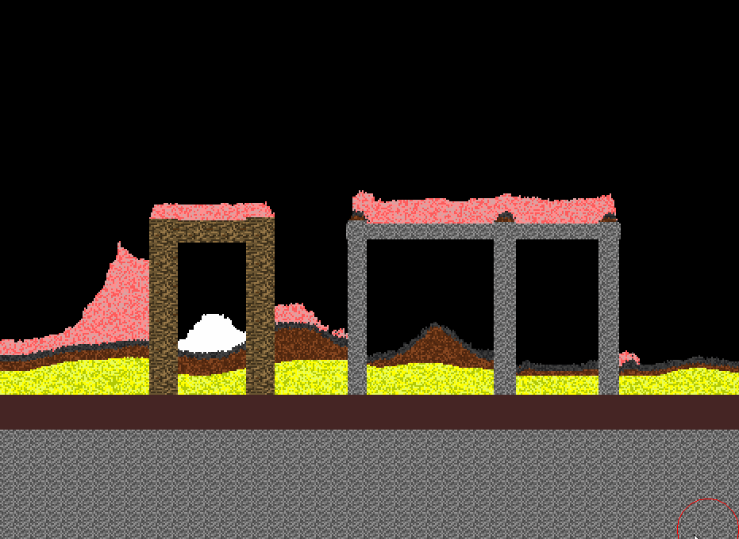

# FallingSandJava
Falling sand simulation written in Java and LIBGDX

YouTube video tutorial on how to build this: https://youtu.be/5Ka3tbbT-9E

## Overview: 
Inspired by classic falling sand games I am making one of my own. The intent is to build and release a falling sand 
simulation simlar to the ones from the early 2000's. Plans past that are to create a local multiplayer combat game 
within the falling sand simulation taking influence from [Duck Game](https://store.steampowered.com/app/312530/Duck_Game/0) 
and integrating the falling sand simulation with [Box2D](https://box2d.org/) taking influence from [Noita](https://noitagame.com/).

Online multiplayer would require extremely sophisticated systems to allow for smooth gameplay when each game object is 
one pixel square. This would be too much to synchronize with basic online implementations. However, With recent 
improvements in streaming online multiplayer should be possible through 
[Steam Remote Play](https://store.steampowered.com/streaming/) or [Parsec](https://parsecgaming.com/).

## Integrating Box2D
Integrating Box2D with a falling sand simulation presents unique technical challenges.
The Noita developers have gone into some detail in their video [Exploring the Tech and Design of Noita](https://youtu.be/prXuyMCgbTc?t=322) 

The basic steps are:

* Take a 2D array of elements and use marching squares algorithm to get the contour
* Use a Douglas-Peucker line simplification algorithm to reduce the amount of vertices 
* Pass the simplified set of vertices to a triangulation algorithm
* Create a Box2D rigidbody from all the resulting triangles
* If any elements in the rigidbody are destory repeat the process

